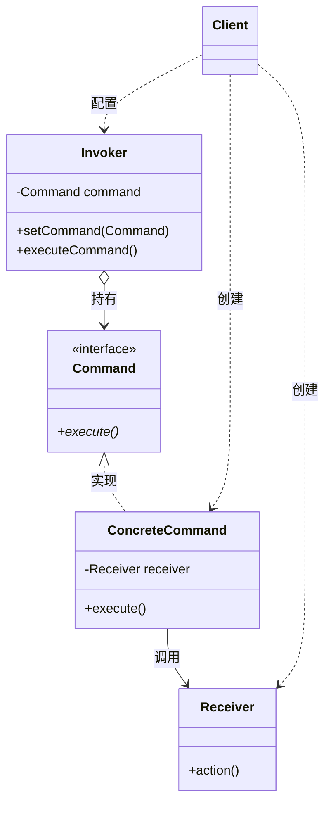

# 命令模式 (Command Pattern) 完整教程

## 目录
- [定义](#定义)
- [核心概念](#核心概念)
- [参与者角色](#参与者角色)
- [UML 类图](#uml-类图)
- [优点](#优点)
- [缺点](#缺点)
- [适用场景](#适用场景)
- [代码示例](#代码示例)
- [Lambda 表达式优化](#lambda-表达式优化)
- [最佳实践](#最佳实践)
- [常见问题](#常见问题)

---

## 定义

**命令模式**是一种行为型设计模式，它将请求封装为一个对象，从而使您可以：
- 用不同的请求对客户进行参数化
- 对请求排队或记录请求日志
- 支持可撤销的操作

> **核心思想**：将"行为请求者"与"行为实现者"解耦，通过命令对象作为中介。

---

## 核心概念

### 关键要素

1. **封装请求**：将方法调用封装成对象
2. **解耦**：调用者不需要知道接收者的具体实现
3. **队列化**：命令可以被存储、排队、延迟执行
4. **可撤销**：通过存储状态实现 undo/redo

### 真实世界类比

**餐厅点餐系统**：
- **客户（Client）**：点菜的人
- **订单（Command）**：记录菜品的纸条
- **服务员（Invoker）**：接收订单并传递给厨房
- **厨师（Receiver）**：真正做菜的人

客户不需要直接和厨师沟通，服务员也不需要知道怎么做菜，订单（命令对象）起到了桥梁作用。

---

## 参与者角色

### 1. Command（命令接口）
```cpp
class Command {
public:
    virtual ~Command() {}
    virtual void execute() = 0;
    virtual void undo() = 0;  // 可选
};
```
**职责**：定义命令的统一接口。

### 2. ConcreteCommand（具体命令）
```cpp
class LightOnCommand : public Command {
private:
    Light* receiver;
public:
    LightOnCommand(Light* light) : receiver(light) {}
    void execute() override { receiver->on(); }
};
```
**职责**：绑定接收者和具体操作。

### 3. Receiver（接收者）
```cpp
class Light {
public:
    void on() { cout << "Light is ON" << endl; }
    void off() { cout << "Light is OFF" << endl; }
};
```
**职责**：执行实际的业务逻辑。

### 4. Invoker（调用者）
```cpp
class RemoteControl {
private:
    shared_ptr<Command> command;
public:
    void setCommand(shared_ptr<Command> cmd) { command = cmd; }
    void pressButton() { command->execute(); }
};
```
**职责**：持有命令对象，触发命令执行。

### 5. Client（客户端）
```cpp
int main() {
    Light* light = new Light();
    Command* cmd = new LightOnCommand(light);
    RemoteControl remote;
    remote.setCommand(cmd);
    remote.pressButton();  // 输出：Light is ON
}
```
**职责**：创建具体命令并配置接收者。

---

## UML 类图



---

## 优点

### ✅ 1. 解耦调用者和接收者
- 调用者无需知道接收者的具体实现细节
- 增加新命令不影响现有代码（开闭原则）

### ✅ 2. 易于扩展
```cpp
// 添加新命令无需修改 Invoker
class TVOnCommand : public Command { ... };
class StereoOnCommand : public Command { ... };
```

### ✅ 3. 支持命令队列
```cpp
queue<shared_ptr<Command>> commandQueue;
// 异步执行、批处理、延迟执行
```

### ✅ 4. 支持撤销/重做
```cpp
stack<shared_ptr<Command>> undoStack;
stack<shared_ptr<Command>> redoStack;
```

### ✅ 5. 支持日志和事务
```cpp
// 记录命令历史
vector<shared_ptr<Command>> history;
// 故障恢复、审计追踪
```

### ✅ 6. 支持宏命令（组合模式）
```cpp
class MacroCommand : public Command {
    vector<shared_ptr<Command>> commands;
    void execute() {
        for (auto& cmd : commands) cmd->execute();
    }
};
```

---

## 缺点

### ⚠️ 1. 类爆炸
**问题**：每个具体操作都需要一个命令类。

**示例**：
```cpp
// 需要定义大量类
class LightOnCommand : public Command { ... };
class LightOffCommand : public Command { ... };
class TVOnCommand : public Command { ... };
class TVOffCommand : public Command { ... };
class StereoOnCommand : public Command { ... };
// ... 100+ 个命令类
```

**解决方案**：使用 Lambda 表达式（见下文）。

### ⚠️ 2. 增加代码复杂度
对于简单操作，直接调用可能更清晰：
```cpp
// 简单直接
light.on();

// 命令模式（过度设计）
invoker.execute(make_shared<LightOnCommand>(&light));
```

### ⚠️ 3. 理解成本
新手可能需要时间理解命令对象的概念。

---

## 适用场景

### ✅ 应该使用命令模式的场景

1. **需要参数化对象的行为**
   - GUI 按钮绑定不同操作
   - 快捷键配置

2. **需要在不同时间执行请求**
   - 任务调度系统
   - 延迟执行队列

3. **需要支持撤销/重做**
   - 文本编辑器
   - 图形设计软件

4. **需要记录操作日志**
   - 数据库事务
   - 系统审计

5. **需要实现回调机制**
   - 异步编程
   - 事件驱动系统

### ❌ 不应该使用的场景

1. **简单的直接调用**
   ```cpp
   // 不需要命令模式
   calculator.add(1, 2);
   ```

2. **性能关键路径**
   - 命令对象创建有性能开销

3. **实时系统**
   - 额外的抽象层可能增加延迟

---

## 代码示例

### 传统实现（具体命令类）

```cpp
// 接收者
class Light {
public:
    void on() { cout << "Light ON" << endl; }
    void off() { cout << "Light OFF" << endl; }
};

// 命令接口
class Command {
public:
    virtual ~Command() {}
    virtual void execute() = 0;
};

// 具体命令
class LightOnCommand : public Command {
private:
    Light* light;
public:
    LightOnCommand(Light* l) : light(l) {}
    void execute() override { light->on(); }
};

class LightOffCommand : public Command {
private:
    Light* light;
public:
    LightOffCommand(Light* l) : light(l) {}
    void execute() override { light->off(); }
};

// 调用者
class RemoteControl {
private:
    queue<shared_ptr<Command>> commandQueue;
public:
    void addCommand(shared_ptr<Command> cmd) {
        commandQueue.push(cmd);
    }
    void executeAll() {
        while (!commandQueue.empty()) {
            commandQueue.front()->execute();
            commandQueue.pop();
        }
    }
};

// 客户端
int main() {
    auto light = make_shared<Light>();
    RemoteControl remote;
    
    remote.addCommand(make_shared<LightOnCommand>(light.get()));
    remote.addCommand(make_shared<LightOffCommand>(light.get()));
    
    remote.executeAll();
    return 0;
}
```

---

## Lambda 表达式优化

### 问题：类爆炸

传统命令模式需要为每个操作定义一个类，导致类数量急剧增加。

### 解决方案：Lambda Command

#### 1. 创建通用命令类

```cpp
class LambdaCommand : public Command {
private:
    std::function<void()> action;
public:
    LambdaCommand(std::function<void()> func) : action(func) {}
    void execute() override {
        if (action) action();
    }
};
```

#### 2. 在 Invoker 中添加重载

```cpp
class RemoteControl {
public:
    // 原有方法
    void addCommand(shared_ptr<Command> cmd) { ... }
    
    // Lambda 重载
    void addCommand(std::function<void()> func) {
        addCommand(make_shared<LambdaCommand>(func));
    }
};
```

#### 3. 使用示例

```cpp
int main() {
    auto light = make_shared<Light>();
    auto tv = make_shared<TV>();
    RemoteControl remote;
    
    // ✅ 方式1：具体命令类（适合复杂逻辑）
    remote.addCommand(make_shared<LightOnCommand>(light.get()));
    
    // ✅ 方式2：Lambda 表达式（适合简单操作）
    remote.addCommand([&light]() { light->on(); });
    remote.addCommand([&light]() { light->off(); });
    
    // ✅ 组合操作
    remote.addCommand([&]() {
        light->on();
        tv->turnOn();
    });
    
    return 0;
}
```

### Lambda vs 具体类对比

| 场景 | 推荐方式 | 原因 |
|------|---------|------|
| 简单一次性操作 | Lambda | 代码简洁 |
| 需要撤销功能 | 具体类 | 需要保存状态 |
| 复杂业务逻辑 (>10行) | 具体类 | 可读性、可测试性 |
| 组合多个操作 | Lambda | 灵活便捷 |
| 需要命令复用 | 具体类 | 可以创建实例共享 |

---

## 最佳实践

### 1. 内存管理

使用智能指针避免内存泄漏：
```cpp
// ✅ 推荐
shared_ptr<Command> cmd = make_shared<LightOnCommand>(light.get());

// ❌ 避免
Command* cmd = new LightOnCommand(light);  // 容易忘记 delete
```

### 2. 接收者的生命周期

命令应该**观察**接收者，而不是**拥有**接收者：
```cpp
// ✅ 推荐：使用原始指针观察
class LightOnCommand : public Command {
    Light* light;  // 不负责删除
};

// ❌ 避免：命令拥有接收者
class LightOnCommand : public Command {
    shared_ptr<Light> light;  // 可能导致循环引用或所有权混乱
};
```

### 3. 异步执行

使用队列 + 工作线程：
```cpp
class AsyncInvoker {
private:
    queue<shared_ptr<Command>> queue;
    thread workerThread;
    
    void processCommands() {
        while (true) {
            auto cmd = dequeue();  // 带锁保护
            if (cmd) cmd->execute();
        }
    }
    
public:
    AsyncInvoker() {
        workerThread = thread(&AsyncInvoker::processCommands, this);
    }
};
```

### 4. 撤销功能实现

```cpp
class UndoableCommand : public Command {
public:
    virtual void execute() = 0;
    virtual void undo() = 0;
};

class LightOnCommand : public UndoableCommand {
private:
    Light* light;
public:
    void execute() override { light->on(); }
    void undo() override { light->off(); }
};

class Invoker {
private:
    stack<shared_ptr<UndoableCommand>> history;
    
public:
    void executeCommand(shared_ptr<UndoableCommand> cmd) {
        cmd->execute();
        history.push(cmd);
    }
    
    void undo() {
        if (!history.empty()) {
            history.top()->undo();
            history.pop();
        }
    }
};
```

### 5. 宏命令（组合命令）

```cpp
class MacroCommand : public Command {
private:
    vector<shared_ptr<Command>> commands;
    
public:
    void addCommand(shared_ptr<Command> cmd) {
        commands.push_back(cmd);
    }
    
    void execute() override {
        for (auto& cmd : commands) {
            cmd->execute();
        }
    }
};

// 使用示例：一键关闭所有设备
auto closeAll = make_shared<MacroCommand>();
closeAll->addCommand(make_shared<LightOffCommand>(light.get()));
closeAll->addCommand(make_shared<TVOffCommand>(tv.get()));
closeAll->addCommand(make_shared<StereoOffCommand>(stereo.get()));
remote.addCommand(closeAll);
```

---

## 常见问题

### Q1: 命令模式 vs 策略模式？

**命令模式**：
- 关注"做什么"（封装请求）
- 可以排队、撤销、记录
- 通常有接收者

**策略模式**：
- 关注"怎么做"（封装算法）
- 运行时切换算法
- 没有接收者概念

### Q2: 命令对象应该有状态吗？

- **无状态命令**：更容易复用，类似函数式编程
- **有状态命令**：适合实现撤销功能，保存执行前的状态

```cpp
// 有状态的可撤销命令
class ChangeVolumeCommand : public UndoableCommand {
private:
    Stereo* stereo;
    int oldVolume;  // 保存状态
    int newVolume;
    
public:
    void execute() override {
        oldVolume = stereo->getVolume();  // 记录旧值
        stereo->setVolume(newVolume);
    }
    
    void undo() override {
        stereo->setVolume(oldVolume);  // 恢复旧值
    }
};
```

### Q3: 如何处理命令失败？

```cpp
class Command {
public:
    virtual bool execute() = 0;  // 返回执行结果
};

class Invoker {
    void executeCommand(shared_ptr<Command> cmd) {
        if (!cmd->execute()) {
            // 处理失败：重试、记录日志、通知用户
            logError("Command execution failed");
        }
    }
};
```

### Q4: Lambda 表达式能实现撤销吗？

不能直接实现标准的撤销功能，需要配合使用：

```cpp
// 需要同时传递 execute 和 undo lambda
remote.addUndoableCommand(
    []() { light->on(); },   // execute
    []() { light->off(); }   // undo
);
```

但这种情况下，使用具体命令类会更清晰。

---

## 总结

### 何时使用命令模式

| 需求 | 是否使用 |
|------|---------|
| 需要撤销/重做 | ✅ 是 |
| 需要队列化请求 | ✅ 是 |
| 需要记录操作日志 | ✅ 是 |
| 需要参数化操作 | ✅ 是 |
| GUI 事件处理 | ✅ 是 |
| 简单的方法调用 | ❌ 否 |
| 性能敏感的代码 | ❌ 否 |

### 实现技巧

1. **混合使用**：具体命令类 + Lambda 表达式
2. **智能指针**：避免内存泄漏
3. **异步执行**：队列 + 工作线程
4. **组合模式**：实现宏命令
5. **简单优先**：不要过度设计

### 本项目特点

- ✅ 支持具体命令类（可扩展）
- ✅ 支持 Lambda 表达式（避免类爆炸）
- ✅ 异步命令队列（后台线程）
- ✅ 智能指针管理内存
- ✅ 灵活的调用方式
