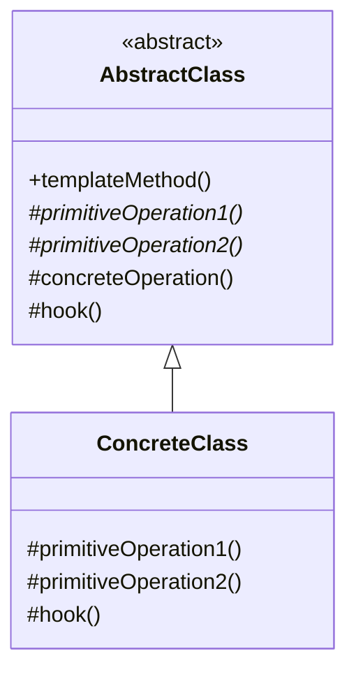

# 模版方法模式 (Template Method Pattern)

## 1. 模式定义
**模版方法模式**在一个方法中定义一个算法的骨架，而将一些步骤延迟到子类中。模版方法使得子类可以在不改变算法结构的情况下，重新定义算法中的某些步骤。

它属于**行为型设计模式**。

## 2. 模式结构
模版模式主要包含以下两个角色：

1.  **AbstractClass (抽象类)**:
    *   定义抽象的原语操作（`PrimitiveOperation`），具体的子类将重定义它们以实现一个算法的步骤。
    *   实现一个模版方法（`TemplateMethod`），定义算法的骨架。该模版方法调用原语操作以及抽象类中定义但在子类中未被重写的其他操作。

2.  **ConcreteClass (具体类)**:
    *   实现原语操作以完成算法中与特定子类相关的步骤。

### UML 类图

### C++ 实现细节：NVI (Non-Virtual Interface)
在 C++ 中，实现模版模式的最佳实践通常结合 **NVI** 惯用法：
1.  **模版方法 (`prepareRecipe`) 是 `public` 且 `non-virtual` 的**：这保证了算法骨架的**封闭性**，子类不能通过多态重写来改变流程。这比使用 `virtual ... final` 更加自然。
2.  **基本操作 (`brew`, `addCondiments`) 是 `protected` 且 `virtual` 的**：这保证了实现的**开放性**，子类必须或可以去提供具体实现，且仅供父类(模版方法)调用。

## 3. 代码示例解析
我们在 `main.cpp` 中实现了一个制作咖啡因饮料的例子：

*   **CaffeineBeverage (抽象类)**:
    *   `prepareRecipe()` 是模版方法，定义了泡茶/咖啡的固定流程：烧水 -> 冲泡 -> 倒进杯子 -> 加调料。
    *   此方法被定义为**非虚函数** (NVI)，子类无法通过多态重写它，从而保证了算法结构的稳定。
    *   `boilWater()` 和 `pourInCup()` 是通用步骤，直接在父类实现。
    *   `brew()` 和 `addCondiments()` 是抽象方法，强制子类去实现。

*   **Tea / Coffee (具体类)**:
    *   实现了各自特定的 `brew()` (浸泡 vs 冲泡) 和 `addCondiments()` (加柠檬 vs 加糖奶) 逻辑。

## 4. 适用场景
*   一次性实现一个算法的不变部分，并将可变的行为留给子类来实现。
*   各子类中公共的行为应被提取出来并集中到一个公共父类中以避免代码重复。（代码复用的典型例子）
*   控制子类扩展。模版方法只在特定点调用“钩子”操作（Hook），这样就只允许在这些点进行扩展。

## 5. 优缺点
### 优点
*   **封装不变部分，扩展可变部分**：把认为是不变部分的算法封装到父类实现，可变部分的算法由子类继承实现，便于子类继续扩展。
*   **提取公共代码，便于维护**：行为由父类控制，子类实现。
*   **行为受控**：父类定义了算法的步骤，子类只能在父类制定好的框架下执行。

### 缺点
*   **类数目增加**：每一个不同的实现都需要一个子类来实现，导致类的个数增加，使得系统更加庞大。
*   **继承关系反向**：父类调用子类的方法（好莱坞原则：“不要调用我们，我们会调用你”），可能增加代码阅读难度。
